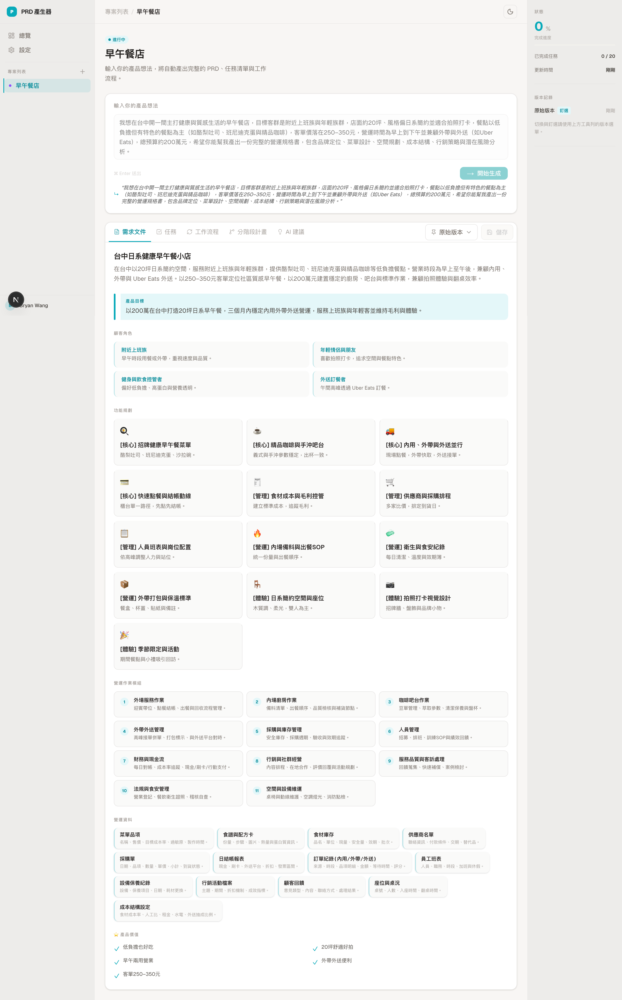

# AI PRD 產生器

> 輸入一句產品概念，AI 自動生成完整的產品需求文件（PRD）

**[➜ 線上 Demo：AI PRD 產生器](https://aiprd-studio.vercel.app/)**



## 功能介紹

- 輸入產品想法，自動生成 PRD、任務清單、開發流程、階段規劃、策略建議
- 多專案管理，支援版本歷史與釘選
- OpenAI API Key 由使用者自行輸入，不經過後端，資料存在本機
- 深色 / 淺色模式切換

## 使用技術

| 類別     | 使用技術                                      |
| -------- | --------------------------------------------- |
| 框架     | Next.js 15 App Router                         |
| UI       | React 19、Tailwind CSS v4、shadcn/ui          |
| 狀態管理 | Zustand                                       |
| AI       | OpenAI SDK（Structured Output + JSON Schema） |
| 資料儲存 | localStorage                                  |
| 語言     | TypeScript                                    |


## 資料夾結構

```
app/api/generate/      # AI 生成 API Route
components/workspace/  # 主要功能 component
prompts/               # AI 系統 Prompt
store/                 # Zustand 狀態管理
types/                 # TypeScript 型別定義
lib/                   # 相關工具與 AI Schema
```

## 本地啟動

```bash
pnpm install
pnpm dev
```

啟動後，點擊設定，輸入你的 OpenAI API Key 即可使用。

> API Key 儲存在瀏覽器 localStorage，不會傳送至任何第三方伺服器。

## Todo

- [ ] 後端資料庫儲存，預計使用 supabase
- [ ] 登入 / 登出 / 註冊 功能
- [ ] 匯出為 Markdown / Notion
